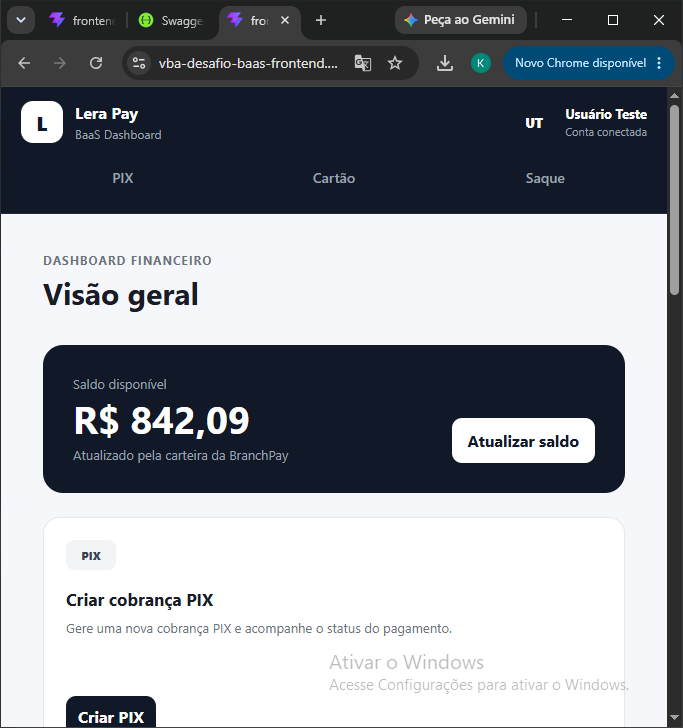
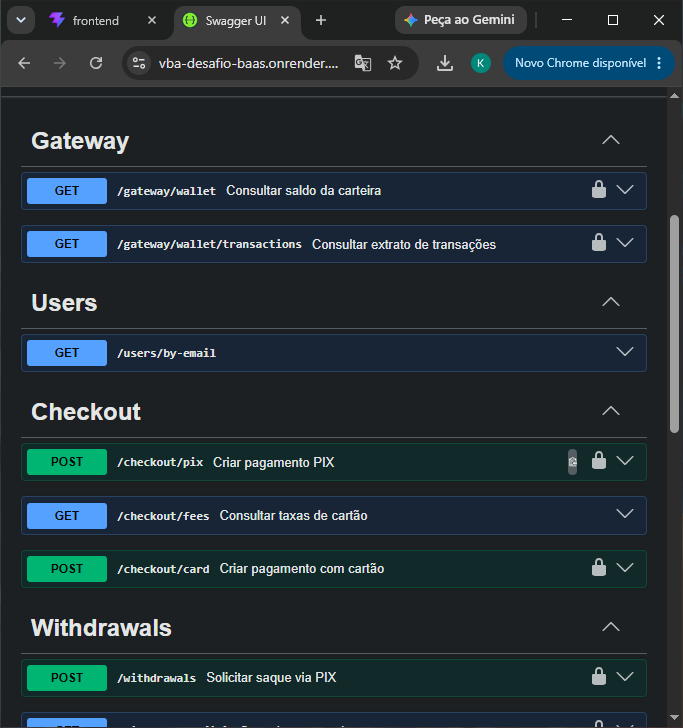
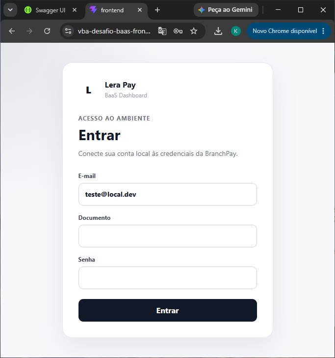
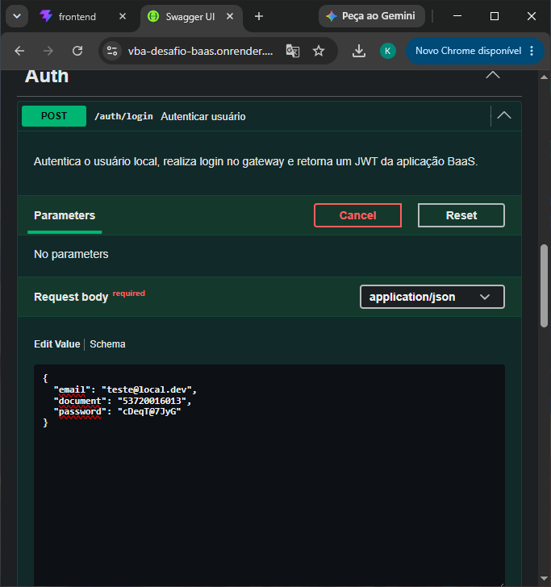
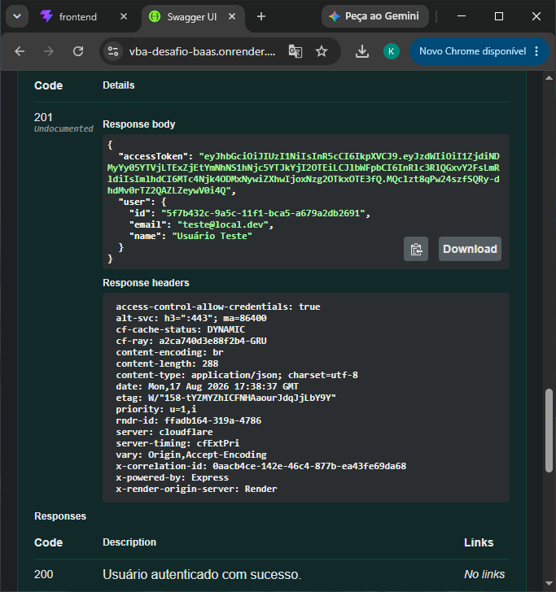

# Lera Pay BaaS 🚀

API BaaS desenvolvida para integração com gateway de pagamentos, permitindo gerenciamento de contas, checkout, consultas financeiras, saques e processamento de webhooks.

O projeto foi desenvolvido utilizando arquitetura modular, separando responsabilidades por domínio e disponibilizando documentação completa via Swagger.

---

## 🔗 Links do Projeto

### Frontend

https://vba-desafio-baas-frontend.onrender.com

### Backend API

https://vba-desafio-baas.onrender.com

### Documentação Swagger

https://vba-desafio-baas.onrender.com/docs

---

# 📸 Screenshots

## Dashboard



## Swagger API



## Login







---

# 🏗️ Arquitetura

O projeto está organizado em:

```text
vba-desafio-baas
│
├── backend
│   └── src
│       ├── modules
│       │   ├── auth
│       │   ├── gateway
│       │   ├── checkout
│       │   ├── withdrawals
│       │   ├── webhooks
│       │   └── users
│       │
│       ├── app.module.ts
│       └── main.ts
│
└── frontend
    └── src
        ├── services
        └── components
```

# 🛠️ Tecnologias utilizadas

## Backend

- Node.js
- NestJS
- TypeScript
- TypeORM
- MySQL
- JWT Authentication
- Swagger/OpenAPI
- Axios
- Class Validator

## Frontend

- React
- TypeScript
- Vite
- Axios

## Infraestrutura

- Render (deploy frontend e backend)
- Aiven MySQL (banco de dados)

---

# ⚙️ Funcionalidades

## Autenticação

- Login integrado com gateway
- Geração de JWT
- Proteção de rotas autenticadas

## Gateway

- Consulta de carteira
- Consulta de transações

## Checkout

- Geração de cobrança PIX
- Pagamento via cartão
- Consulta de taxas

## Saques

- Solicitação de saque
- Consulta de status

## Webhooks

Recebimento de eventos:

- PIX
- Cartão
- Saques

---

# 🔐 Usuário de demonstração

O ambiente de avaliação possui um usuário previamente provisionado.

Email:
teste@local.dev

Documento:
12345678901

Senha:
senha-do-gateway

---

# Fluxo:

````text
Usuário
   |
   v
```http
POST /auth/login
````

|
v
Busca usuário local
|
v
Validação no gateway
|
v
JWT gerado

````

---

# 📚 Documentação da API

A documentação Swagger está disponível em:
https://vba-desafio-baas.onrender.com/docs

Principais endpoints:

## Auth

POST /auth/login

---

## Gateway

GET /gateway/wallet

GET /gateway/wallet/transactions

---

## Checkout

POST /checkout/pix

POST /checkout/card

GET /checkout/fees

---

## Withdrawals

POST /withdrawals

GET /withdrawals/:id

---

## Webhooks

POST /webhooks/lera-box/pix

POST /webhooks/lera-box/card

POST /webhooks/lera-box/withdrawal

---

# 🚀 Como executar localmente

## Pré-requisitos

- Node.js 20+
- MySQL

## Backend

Entrar na pasta:

```bash
cd backend

npm install

npm run start:dev

````

## Frontend

Entrar na pasta:

```bash
cd frontend

npm install

npm run dev
```

---

---

# 🧠 Decisões técnicas

## Arquitetura modular

O backend foi estruturado utilizando módulos do NestJS, permitindo isolamento de responsabilidades e facilitando manutenção e evolução da aplicação.

## Integração com gateway

A comunicação com o gateway foi isolada em um módulo próprio, evitando acoplamento entre regras de negócio e serviços externos.

## Configuração por ambiente

As configurações sensíveis são carregadas através de variáveis de ambiente, mantendo credenciais fora do código fonte.

## Documentação

Swagger/OpenAPI foi utilizado para disponibilizar documentação interativa dos endpoints da API.

---

# 🧪 Testes realizados

Checklist:

✅ Backend publicado
✅ Frontend publicado
✅ Banco MySQL em produção
✅ Comunicação frontend/backend via HTTPS
✅ CORS configurado para produção
✅ Login JWT funcionando
✅ Swagger disponível
✅ Endpoints protegidos testados
✅ Integração com gateway validada

# 🔒 Segurança

Variáveis sensíveis utilizando .env
Credenciais não versionadas
JWT para autenticação
Validação de payloads
Separação de responsabilidades por módulos

# 📌 Observações

O projeto utiliza um usuário previamente provisionado para ambiente de demonstração.

Em um ambiente produtivo real, o fluxo de criação e gerenciamento de usuários poderia ser expandido com:

cadastro de usuários;
recuperação de senha;
gerenciamento de permissões;
auditoria.
